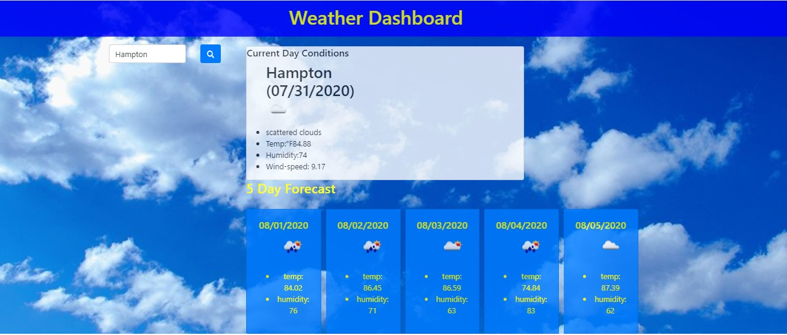

# weather-dashboard

This application was created to provide the user with a 5 day forecast of their selected city. 

This dashboard provides the cities' weather condition, temperature, humidity, wind speed and the UV index. 

This dashboard also has a feature that includes color indications if the conditions are favorable, moderate or severe.

The dashboard will equip the user with great information for daily conditions or if the user is traveling, it will prepare them on how to dress for the day or pack for vacation. 

